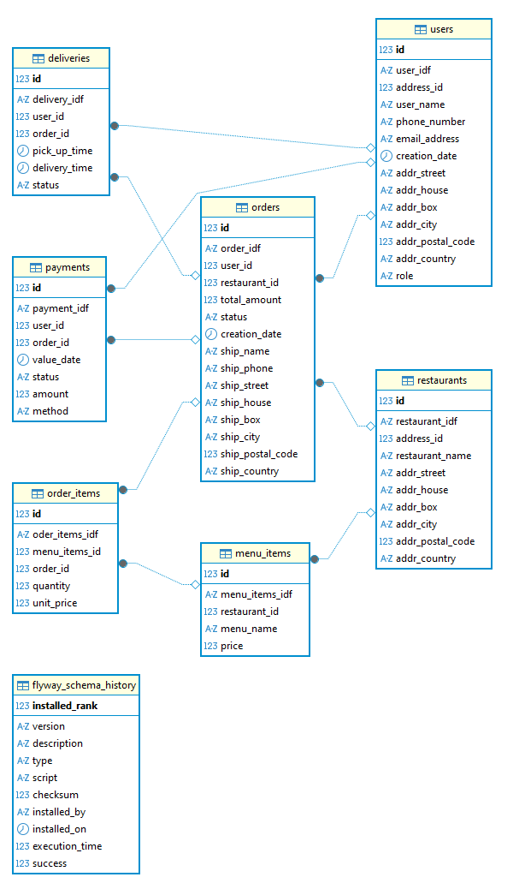

# Order & Pay

A restaurant ordering and payment system built with **Java**, **Spring Boot**, and **MariaDB**.  
The goal of the project is to provide a backend service that manages users, roles, restaurants, addresses, orders, and payments.

---

## 🚀 Features
- User management with roles (`ADMIN`, `CUSTOMER`, `DRIVER`)
- Restaurant registration with linked addresses
- User-to-role mapping (many-to-many)
- Orders and payments (planned for next migrations)
- Flyway database migrations for schema versioning

---

## 🗄️ Database Schema

  
*(Replace with your actual screenshot path)*

---

## ⚙️ Tech Stack
- **Backend**: Java 21, Spring Boot 3.x
- **Database**: MariaDB (compatible with MySQL)
- **Migrations**: Flyway
- **Build Tool**: Maven
- **Testing**: JUnit, Cucumber (planned)

---

## 📦 Getting Started

### 1. Clone the repository
```bash
git clone https://github.com/<your-username>/order-and-pay.git
cd order-and-pay
