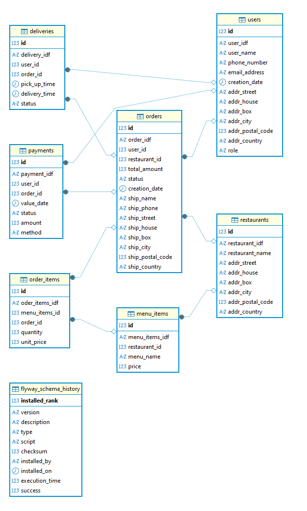

# 🛒 OrderAndPay — Modular Online Ordering Platform

**OrderAndPay** is a personal backend development project that demonstrates the design of a **scalable and maintainable ordering system** for restaurants, cafés, or delivery services.  
It focuses on **clean architecture**, **data consistency**, and **separation of business logic** through a **hexagonal (ports and adapters) architecture**.
mICROSERVICES
---

## 🎯 Purpose and Vision

The goal of **OrderAndPay** is to build a backend capable of managing orders, users, roles, and payments in a modular and extensible way.  
The system is designed to support multiple types of clients — mobile apps, web apps, or APIs used by partner services — without compromising performance or maintainability.

By following modern engineering principles, the project serves both as a **learning environment** and as a **blueprint for enterprise-level backend systems**.

---

## 🧠 Design Philosophy

OrderAndPay is structured around three fundamental principles:

1. **Domain-Driven Design** — business rules are defined within the domain layer, ensuring independence from frameworks and persistence logic.  
2. **Hexagonal Architecture** — the core logic interacts with the outside world through input/output ports, enabling flexibility and easier testing.  
3. **Clean Code and Maintainability** — strict separation of concerns, consistent object mapping, and versioned database migrations guarantee long-term scalability.

These design choices make the system adaptable for new modules such as inventory management, payment integration, and asynchronous event-driven communication.

---

## 🗄️ Database Schema

  

---

## ⚙️ Technology Stack (Brief Overview)

- **Java (Spring Boot 3)** — core framework providing modularity and enterprise-level features.  
- **MariaDB** — relational database for user, product, and order persistence.  
- **MapStruct** — ensures clean mapping between domain, DTO, and persistence layers.  
- **Flyway** — manages database schema versioning and migrations.  
- **JUnit & Cucumber** — validate business logic and use cases through tests.  
- **Docker (planned)** — containerization for deployment consistency.  
- **Apache Kafka (upcoming)** — message broker to handle asynchronous communication between services.

Each component contributes to building a robust, production-ready backend following real-world industry practices.

---

## 🧩 Project Structure Overview

domain/ → Core business logic and domain models
application/ → Use cases and service orchestration
adapters/ → Infrastructure: REST, persistence, mapping, messaging
resources/db/ → Flyway migration scripts
tests/ → Unit and BDD test suites

---

## 🚀 Next Steps and Roadmap

The next major step in **OrderAndPay** is the **integration of Apache Kafka** to introduce message-driven communication.  
This enhancement will enable **real-time event processing**, **decoupled services**, and **scalable transactions** across the system.

### Upcoming Milestones:
- [ ] Integrate **Kafka** as the main message queue (replacing direct service calls)  
- [ ] Create **event producers** for key actions (e.g., order creation, payment initiation, notification trigger)  
- [ ] Implement **Kafka consumers** to handle asynchronous workflows (inventory update, confirmation email, etc.)  
- [ ] Define a **message schema** for standard event communication  
- [ ] Add **monitoring and retry mechanisms** for message delivery reliability  
- [ ] Prepare **Docker Compose** setup with Kafka and Zookeeper containers  

This evolution will bring **OrderAndPay** closer to an event-driven microservice ecosystem — improving scalability, fault tolerance, and responsiveness.

---

## 🧭 Broader Learning Objective

This project represents a personal journey in **enterprise backend design** — from foundational architecture to distributed system communication.  
The integration of Kafka marks a transition toward mastering **asynchronous messaging patterns**, **event-driven systems**, and **microservice interoperability**, which are key skills in modern backend engineering.

---

## 👨‍💻 Author

**Harold Rajaonarison**  
M.Sc. in Computer Science — Artificial Intelligence & Data  
Brussels, Belgium  

This project is part of a professional learning journey focused on backend architecture, modular design, and the practical application of enterprise software principles.

